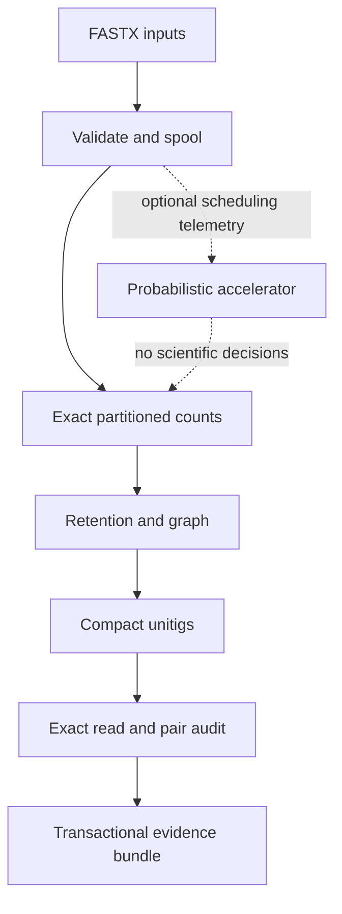

# VeritAsm architecture

Status: Gate 1 implementation architecture for fixed-k assembly contract v0.1. Package
`0.3.0-alpha.1` also contains isolated experimental modules that do not change this stable path.

This document implements the decisions in `RESEARCH.md` and `docs/PRODUCT_CONTRACT.md`. It describes
intended behavior; a component is not implemented merely because it appears here. `VALIDATION.md` and
the release checklist identify which claims have executable evidence.

`docs/CONFIGURATION.md` is normative for support units, limits, FASTX corner semantics, JSON missing
values, and CLI error classes. ADRs take precedence for their named mechanism; a later accepted ADR
must list every superseded paragraph.

## Architectural drivers

1. Exact sequence identity and exact final counts.
2. Evidence and uncertainty remain attached to every reconstructed sequence.
3. Valid FASTX compatibility with the frozen Virustic2 baseline, plus stricter malformed-pair
   behavior.
4. Determinism at every stable artifact boundary.
5. Explicit limits and atomic failure under large or adversarial input.
6. Useful database-free de novo output without an external runtime or network.
7. Conservative pair use and no silent biological interpretation.

## System boundaries

Input, counting, transformation, graph representation, compaction, reconstruction, audit, output,
and CLI are modules in one crate until measurements justify a workspace split. Library APIs return
typed errors and data; the CLI owns argument presentation and exit codes.

## Pipeline state machine

| State | Durable input | Output | Commit eligibility |
|---|---|---|---|
| `created` | CLI configuration | normalized configuration | no |
| `spooling` | source streams | temporary immutable spool and source digests | no |
| `spooled` | completed spool manifest | verified logical fragment stream | no |
| `counting` | spool | temporary exact partition runs | no |
| `counted` | complete partition manifest | sorted exact counts and histogram | no |
| `retained` | exact counts | sorted retained canonical keys | no |
| `compacted` | exact graph | unitigs, graph links, topology journal | no |
| `audited` | spool and unitigs | exact placement and pair evidence | no |
| `rendered` | all scientific structures | staged complete bundle | no |
| `verified` | staged bundle | verified manifest and schemas | yes |
| `committed` | verified staging directory | immutable destination | complete |

There is no successful partial state. Interruption, parse failure, counter corruption, resource
exhaustion, audit indeterminacy that violates a requested strict mode, or render failure prevents
commit. Temporary artifacts are not resumable in 0.1 and carry no valid-completion marker.

## 1. Input and immutable fragment spool

### Source opening

`input` fills a two-byte prefix even when the underlying reader returns one byte at a time, replays that
prefix, and chooses plain or multi-member gzip decoding by content. The filename is irrelevant. Decoder
EOF must consume all members and reject a corrupt/truncated member or non-gzip trailing bytes. Standard
input can occupy only one role because it cannot be replayed safely.

An aggregate counted-reader envelope admits physical transport bytes before decompression and admits
each concatenated gzip member before decoding it. File length metadata may reject an oversized source
early, but the counted reader remains authoritative for standard input and mutation. Exact configured
limits are inclusive; exceeding either limit is a typed input failure and cannot commit output.

At input enumeration, each file-backed role must name a regular file and captures its device/inode
identity on the supported Unix targets. Obvious duplicate roles are rejected from those identities.
At the actual open, the descriptor identity must still match the captured identity and the path must
still name that descriptor; opened identities are registered again so sequential replacement cannot
turn later roles into aliases of earlier ones. Staging compares descriptor snapshots and a second
content digest to detect ordinary mutation or replacement while reading. This is not a filesystem
snapshot and does not defend against a privileged adversary that can change and restore bytes between
checks. The report stores content digests and sanitized role labels rather than unstable absolute
paths. Output paths are separately required to be new directories; the input code does not claim a
general cross-filesystem alias oracle.

### FASTA/FASTQ parser

The parser is a bounded state machine supporting wrapped FASTA and FASTQ. It validates:

- non-empty record identifiers;
- sequence and quality structure;
- equal FASTQ sequence/quality lengths;
- Phred+33 bytes in the supported range;
- allowed IUPAC symbols;
- configured maximum header, record, sequence, quality, and decompressed bytes;
- EOF only at a record boundary.

Errors include source role, lane, record ordinal, normalized identifier where safe, and position.
Malformed records are never skipped.

### Pair synchronization

Paired roles must have the same FASTA/FASTQ format and are advanced together. Header grammar 1 takes
the first nonempty ASCII-whitespace-delimited token as identity, recognizes one terminal `/1` or `/2`,
and recognizes a second CASAVA token only when it begins `1:` or `2:`. The suffix is stripped from the
identity; CASAVA text is not part of identity. If both role forms exist they must agree. Stated roles
must agree with the supplied R1/R2 stream, and normalized identity bytes must match exactly. No Unicode
normalization or case folding occurs.

Missing, extra, role-swapped, reordered, or one-sided repeated records fail at the next synchronized
position. Synchronized repeated identifiers/content are valid distinct supplied record instances and
are counted again; no global ID uniqueness set is kept. Unsuffixed headers are accepted when identities
match, with roles inferred from file position and the inferred-role count reported.

Multiple lanes are ordered input groups. Identifiers need not be globally unique across lanes because
they are record instances, but physical sources cannot repeat and the lane ordinal remains in
diagnostic provenance.

### Spool format

The spool is a private binary format, not a long-term public API, but its bytes are frozen because
`run.json` commits its digest. All integers below are unsigned little-endian; byte arrays have no
padding. Its exact byte stream is:

1. ASCII magic `VTSPOOL1`; schema `u16=1`; `k:u8`; `min_base_quality:u8`; input-mode tag `u8`
   (`0=single_end`, `1=paired_end`); support-unit tag `u8` (`0=supplied_fragment_instance`,
   `1=accepted_window_occurrence`); `source_count:u32`; `fragment_count:u64`; `read_count:u64`.
2. One source descriptor in lane order and role order `S<R1<R2`: `lane_ordinal:u32`, role tag `u8`
   (`0=S`, `1=R1`, `2=R2`), format tag `u8` (`0=FASTA`, `1=FASTQ`), 32 raw-transport digest bytes,
   32 logical-decoded digest bytes, `record_count:u64`, and `base_count:u64`.
3. One length-prefixed fragment in ordinal order. The prefix is `body_length:u64`. The body is
   `fragment_ordinal:u64`, `lane_ordinal:u32`, `read_count:u8` (1 or 2), followed in role order by
   role tag, 32 normalized-identity digest bytes, `sequence_length:u64`, normalized uppercase sequence
   bytes, quality-presence tag `u8` (0 or 1), and, only when present, `quality_length:u64` plus the
   unchanged Phred+33 quality bytes. `body_length` counts every byte after its prefix through the last
   read. Headers and description text are not retained.
4. ASCII trailer magic `VTSEND01`; `pretrailer_length:u64`; `fragment_count:u64`; `read_count:u64`;
   and 32 digest bytes. That digest is SHA-256 of
   `"veritasm:spool-pretrailer:v1\0" || pretrailer_length_u64_le || every preceding spool byte`.

The normalized-identity digest is SHA-256 of
`"veritasm:normalized-id:v1\0" || identity_length_u64_le || normalized_identity_bytes`. A source's
raw-transport digest is SHA-256 of
`"veritasm:raw-transport:v1\0" || byte_count_u64_le || exact_physical_source_bytes`; its
logical-decoded digest uses the corresponding domain `"veritasm:logical-decoded:v1\0"` and the exact
bytes produced after gzip decoding (or the unchanged plain bytes). The `spool.sha256` committed in
`run.json` is ordinary SHA-256 of the entire completed spool byte stream.

Parsing first streams record bodies to a private payload and gathers source summaries, then writes the
final header, copies the payload, and writes the trailer without holding the input in memory. Every
length, count, ordinal, role, configuration field, source summary, and both checksum layers are
verified before downstream passes. Records are independently bounds-checked before allocation. The
completed spool is immutable, is never reused across invocations in 0.1, and is opened read-only by
every scientific pass.

## 2. Exact canonical k-mer extraction

DNA uses A=00, C=01, G=10, T=11 in a `u128`. Forward and reverse-complement rolling codes are updated
with checked masks for every `3 <= k <= 63`. Equality is always full packed-key equality. Odd and even
k are supported; a self-reverse-complement key is stored once.

An ambiguous base resets both rolling windows. A FASTQ window is accepted only if every base meets the
declared minimum Phred threshold. The scanner separately counts possible windows, accepted windows,
quality-rejected windows, ambiguity-rejected windows, and windows rejected for both reasons under a
versioned mutually exclusive accounting rule.

Fragment mode sorts and deduplicates canonical keys across both mates before emission. Occurrence mode
emits every accepted window. Parallel workers receive fixed ordinal batches and return sorted runs;
integer reductions and final merge use stable order.

## 3. Exact disk-backed counting

The counter never uses a hash as sequence identity.

### Partition and run generation

Use `P = 2^p` numeric range partitions. `p` is configuration validated as `0 <= p <= min(8, 2*k)`;
the partition is the high `p` bits of the active `2*k`-bit canonical key. Partition count is therefore
independent of thread count, and concatenating finalized partitions in numeric order is global full-key
order. Range skew is tolerated through bounded runs rather than by loading one partition.

Workers scan fixed ordinal batches. The indexed parallel result is consumed in input order, and the
counter rejects a missing, duplicated, or out-of-order fragment ordinal before accepting its events.
The counter buffers `(numeric_partition, full_key)` events and names raw runs by partition and a
deterministic flush ordinal; a name never depends on worker completion order. Version 0.1 does not
implement one central runtime memory-token allocator. Instead, each phase uses checked, conservative
allocation admission and fixed shares for objects that can coexist. Those estimates, their scope, and
their limitations are part of the resource contract below.

Within its admitted sort-buffer capacity, a run is sorted by full key and duplicate deltas are combined
with checked `u64` arithmetic. Merging uses at most 16 input runs plus one output file. More runs require
deterministic multi-pass groups of 16, named by partition, merge pass, and group ordinal. At most 17
count files are open concurrently inside the count stage. `max_runs` is enforced before another run is
created. The bounded append-only temporary manifest records each filename, numeric partition, record
count, byte count, and SHA-256 digest. Run headers additionally bind `k`, prefix width, partition, and
record count; trailers bind all preceding run bytes. Every produced and consumed run is structurally
and cryptographically checked. Live ordinal coverage is checked by the counter itself, not reconstructed
from the manifest, and version 0.1 provides no interrupted-run resume or temporary-run reuse. Numeric-
order iteration of the final partition streams yields the globally sorted count stream while opening
only one final partition at a time.

### Exactness-preserving sieve prototype

ADR 0004 authorizes a research prototype, not use in the stable 0.1 assembly path. For
`support_unit = supplied_fragment_instance && min_support >= 2`, a two-hit Bloom sieve can identify a
superset of keys eligible for exact
recounting. Within each fragment, keys are first deduplicated. A key observed in the `seen_once` filter
is inserted into `seen_twice`, and every key is then inserted unconditionally into `seen_once`. A
second complete spool pass sends every key whose `seen_twice` query is positive to the exact external
counter. Containment requires classic insertion-only filters, completed insertions, identical
key/hash/dimension/seed semantics, no cleared or corrupt bits, ordered first-pass state updates,
identical QC and fragment deduplication, and complete passes over the same immutable spool. Under those
premises, false positives add exact work and cannot change the retained key set or its counts. Filter
occupancy is a performance condition, not a no-false-negative premise.

The sieve does not enumerate exact keys or cardinalities outside that candidate superset. It therefore
cannot supply the complete pre-threshold histogram and deletion ledger required by the stable product
contract. The first release keeps it outside normal assembly output and benchmarks it against the
no-sieve oracle. It can enter the stable path only after a later schema/contract decision either
supplies those exact fields independently or explicitly changes their availability without weakening
retained-key exactness. Probabilistic graph membership remains forbidden.

### Retention

The exact count histogram is complete before retention. The declared support rule is applied without
automatic adjustment. Every retained `(canonical_key, checked_support)` is written in sorted order.
The number of retained keys is checked against the configured graph cap before graph allocation.

## 4. Exact graph and transformations

The first slice uses a static sorted canonical-key table with parallel support arrays and dense state
bits. Neighbors are generated by adding each DNA base to each orientation and located by binary search
in the full-key table. This trades some construction speed for low metadata overhead, deterministic
iteration, and a small auditable state space. A hash index can replace lookup only after a benchmark and
must not affect output order.

For a retained canonical k-mer `c`, an oriented handle is `(c,+)` spelling `c` or `(c,-)`
spelling `reverse_complement(c)`. When those spellings are equal, only `(c,+)` exists. The source and
target of a view are its literal packed `(k-1)`-base prefix and suffix. Thus a non-self-reverse-
complementary canonical key has two reverse-complementary views but exactly one support value; the
views are navigation states, not two observations. Oriented-view identity is the complete tuple
`(full_canonical_key, orientation)`. Traversal order compares the unsigned packed oriented spelling,
then `+<-`; equal spellings can occur only for the one-view self-reverse-complement case.

For every literal `(k-1)`-mer node, indegree and outdegree count distinct incident oriented-view
identities, never support mass. A node is a compaction boundary when its indegree is not one, its
outdegree is not one, or its sequence equals its reverse complement. The last rule prevents an
orientation switch from being hidden at a palindromic node. Neighbors are the retained views whose
literal suffix/prefix node codes are equal. These definitions, reverse-complement symmetry, degrees,
and palindromic-boundary behavior have exhaustive small-k property oracles.

Transformations implement `analyze(frozen_view) -> DecisionSet` and
`apply(DecisionSet) -> JournalEntry`. A stage cannot observe mutations it makes in the same round.
Decisions are sorted and reverse-complement symmetric. Journal entries include algorithm ID/version,
support unit, parameters, pre/post graph digest, removed-key count, removed support mass, and a digest
of the sorted removed `(full_key,support)` decision set. Version 0.1 does not promise an individual-key
event artifact.

The `retain_all` profile applies no deleting transformation. The initial `thresholded` slice supports
only an absolute exact support threshold during retention. That retention is transformation stage 1
and always gets a summary row, including a no-op row. Version 0.1 has no deleting tip or bubble rule.
Version 0.1 performs no low-complexity deletion and emits no unversioned low-complexity score.

## 5. Deterministic compaction and reconstruction

Compaction first works on the complete sorted oriented-view set. In node-code order, and then outgoing
view order, start one walk from every unused outgoing view of every boundary node. Append the current
view; while its target is not a boundary, append that node's sole outgoing view. Stop before entering
an already used view or after reaching a boundary; either unexpected condition that violates the
degree model is an internal-invariant error. After boundary-started walks are exhausted, repeatedly
choose the smallest unused oriented-view identity and follow sole outgoing views until returning to
the start. A leftover that does not form a closed one-in/one-out component is an internal-invariant
error. This visits every oriented view exactly once.

For a handle `e`, let `mate(e)` be the handle spelling its reverse complement; let `rc(W)` be
`mate(reverse(W))`. Linear raw walks are partitioned into exact orbits under `rc`; closed raw walks are
partitioned under `rc` and cyclic rotation. The representative is the unsigned lexicographic minimum
handle-spelling tuple in the orbit. A linear representative is spelled from its first complete handle
and subsequent final bases. A closed representative is spelled the same way after rotation selection;
for `edge_steps=n`, its final `k-1` bases equal its first `k-1` bases. The emitted sequence is the
representative spelling itself; the orbit comparison has already considered its reverse complement.
The corresponding representative orientation is retained for link mapping. The repeated terminal
context of a closed spelling is a linear representation of an algorithmic graph cycle, not evidence
of a circular molecule. Only a component reached in the residual all-one-in/one-out cycle phase is
labelled `closed_graph_walk`.

`edge_steps` is raw representative-walk length. `canonical_kmers` is the cardinality of the distinct
backing canonical-key set in the entire orbit. A node is a compaction boundary when its indegree or
outdegree differs from one, when the node is self-complemental, or when it is incident to a
self-complemental k-mer handle. The final condition makes every even-k self-complemental edge a
one-edge segment and prevents a representative walk from consuming both orientations of one backing
canonical key. Consequently every emitted unitig must satisfy `edge_steps == canonical_kmers`, and
its representative must contain no repeated canonical-key index. Support statistics visit each
backing key exactly once. After orbit collapse, every retained canonical key must belong to exactly
one emitted unitig orbit, while every oriented handle belongs to exactly one raw walk. Violating any
of these conservation equations, or finding unequal orbit metadata for one output identity, is an
internal-invariant error. Linear paths never cross a boundary. Exact neighboring transitions remain
in GFA even when conservative fixed-point boundaries shorten FASTA. There is no length or other
post-compaction unitig filter in 0.1: every compacted unitig is emitted and the same linear set is used
by the audit.

For each emitted unitig, GFA orientation `+` follows the selected representative and `-` follows its
`rc` walk; both labels may describe the same handle tuple for a self-reverse-complementary orbit. Each
raw walk records every matching `(unitig_id, orientation)` representation. For every boundary node,
form every directed transition from a raw walk ending at that node to a raw walk starting there. Map
those walks to their emitted oriented segments. Also emit the last-to-first closure of each residual
cycle. Every resulting link must independently satisfy equality of the oriented segment suffix and
target prefix for exactly `k-1` bases.

The overlap is the literal decimal `<k-1>M`. A link and its reverse-complement representation
`(A,oa,B,ob)` / `(B,flip(ob),A,flip(oa))` are one relation; retain the typed lexical minimum using full
unitig-ID bytes and `+<-`, then sort and deduplicate exact canonical tuples. Legitimate hairpin and
self-links remain. Pair observations never create GFA links. A residual cycle therefore retains its
canonical self-link, but a self-link alone never creates the `closed_graph_walk` label. Closed-walk
construction-read and pair fields are `NA` with reason `closed_walk_audit_unsupported` and table status
`unavailable_closed_walk_audit_unsupported` in 0.1.

The sequence digest is SHA-256 of the emitted sequence bytes alone. The unitig identity digest is
SHA-256 over `"veritasm:unitig:v1\0" || k_as_one_u8 || topology_tag_as_one_u8 ||
sequence_length_as_u64_le || emitted_sequence`, where topology tag 0 is `linear` and 1 is
`closed_graph_walk`. The stable ID is the ASCII string `utg-` followed by all 64 lowercase hexadecimal
digest characters. No shortened digest is a machine identity.

## 6. Exact construction-read remapping audit

The stable audit uses a fixed-q15 literal rarest-seed index to enumerate candidate placements from
immutable-spool reads against **all emitted linear unitigs and no other targets**. Every candidate is
verified against the complete read; reads shorter than q use exhaustive interval scanning. The
exhaustive implementation remains compiled for tests as an independent differential oracle. Closed-
walk spellings and paths crossing GFA segment boundaries are excluded from this target universe and
never participate in a uniqueness statement. Version 0.1 allows zero mismatches only. An eligible read contains only A/C/G/T
after ASCII case normalization and, for FASTQ, every base meets the configured construction quality
threshold. Other reads are `ineligible_ambiguity_or_quality`.

A placement group is
`(unitig_id, zero_based_half_open_start, zero_based_half_open_end, strand)`. Coordinates always refer
to the emitted canonical forward sequence. Strand `+` means the normalized read bytes match that
forward interval; strand `-` means the reverse complement of the read bytes matches it. Matching the
same interval and strand is one group; different intervals or strands are different, including the
two strands of a palindromic read.
Targets are visited by full unitig ID byte order, starts by numeric order, and strand `+` before `-`.
Complete read bytes or their reverse complement must match. The resource cap counts distinct accepted
placement groups, not seed hits or verifier calls. Candidate enumeration continues until the complete
indexed candidate universe is exhausted or accepted group `limit+1` is found. The extra group yields
`indeterminate_candidate_limit`; every retained candidate prefix is discarded and cannot contribute
to an aggregate or link. Rarest-seed selection is only an exact candidate-generation optimization: a
candidate cannot become evidence without whole-read verification, and differential tests require the
same placement universe and limit behavior as exhaustive interval scanning.

Each read has exactly one derived state: `not_requested`, `ineligible_ambiguity_or_quality`,
`indeterminate_candidate_limit`, `unmapped`, `single_placement_group`, or
`multiple_placement_groups`. Placement groups are present only for the last two complete mapped
states; `unmapped` has an empty complete set and every other state has no set. Define `ReadAudit` as
`(fragment_ordinal, mate_role S|R1|R2, state, sorted_distinct_placement_groups_or_NA)`. Every read,
including both mates, is evaluated independently before pair-summary precedence is applied; a state
on one mate never short-circuits auditing the other. After one global candidate-limit event, remaining
reads are still audited so pair-state counts and any otherwise eligible links are complete, although
the affected run-wide unitig placement aggregates remain `NA`. Per-unitig aggregates are read-instance
quantities:

- `enumeration_complete_read_placements` counts all accepted groups on the unitig from
  enumeration-complete reads;
- `single_group_read_instances` counts reads whose sole accepted group is on the unitig; and
- `multi_group_read_instances_with_group` counts a read once when its multiple accepted groups include
  the unitig, regardless of how many of that read's groups lie there.

Pair mates contribute as separate read instances to these fields. If any eligible read is
`indeterminate_candidate_limit`, all placement aggregates for every linear unitig are `NA` and the
unitig status is indeterminate, because an unenumerated group could affect any row. No indeterminate
read becomes zero, unique, or exact.

The sums of the three complete per-unitig aggregates reconcile respectively to all accepted placement
groups on linear targets, all complete single-group read instances, and all `(read instance, unitig)`
memberships from complete multiple-group reads. All sums use checked `u64`. Here, `exact placement`
means a complete sequence match under the recorded mapper and emitted-linear-unitig target universe;
it does not identify the true biological origin or state that an unmapped read lacks support elsewhere
in the graph. The audit reuses construction reads and is labelled internal consistency, not independent
validation.

## 7. Paired-end observations

A paired fragment is classified by this first-matching decision tree, which is also the enum/sort
order in `pair_audit_summary.tsv`:

1. `remap_not_requested` when remapping is disabled;
2. `mate_ineligible` when either mate is ineligible;
3. `mate_indeterminate_candidate_limit` when either remaining mate is indeterminate;
4. `mate_unmapped` when either remaining mate is unmapped;
5. `mate_multiple_placement_groups` when either remaining mate has multiple groups;
6. `same_linear_unitig` when the two sole groups use the same unitig;
7. `endpoint_tie` when either different-unitig placement is equally distant from both ends; or
8. `cross_unitig_observation` otherwise.

Thus every paired fragment enters exactly one state even when the two mates have different failures.
Both per-read audits are nevertheless completed first; this precedence classifies an already computed
pair and does not short-circuit mapping.
For single-end input, the required summary contains only `not_paired_input` with all supplied
single-end fragments. No stable 0.1 state attempts to declare library-orientation compatibility.

For an accepted placement `[start,end)` on the emitted canonical forward segment of length `L`, left
distance is `start` and right distance is `L-end`, irrespective of strand. The nearer canonical
boundary is the selected endpoint and its corresponding distance is recorded; equality is
`endpoint_tie` and is not grouped. Version 0.1 imposes no endpoint-window
threshold, strand compatibility rule, insert model, span quantile, or gap formula. Same-unitig uniquely
placed pairs are counted in their own summary state and do not estimate a library distribution.

Cross-unitig evidence is grouped by supplied lane and the canonical endpoint tuple:

`(lane_ordinal, segment_a, end_a, strand_a, end_distance_a, mate_role_a, segment_b, end_b, strand_b,
end_distance_b, mate_role_b)`.

Each endpoint is `(full_unitig_id, end, strand, end_distance, mate_role)`. Enum ranks are `L<R`,
`+<-`, and `R1<R2`; distances compare numerically and IDs compare UTF-8 bytes. `swap` exchanges the
two complete endpoints with their mate roles. Because coordinates and ends are anchored to the
emitted canonical sequence, reverse-complementing an endpoint would name its opposite physical end
and is **not** a serialization symmetry. Canonicalization therefore selects only the typed lexical
minimum of the tuple and its swap.
A group stores exact supplied-fragment-instance support. It is
labelled `exact_unique_placement_pair_observation`, not qualified or validated. Version 0.1 emits no
GFA `J`, gap, or inferred adjacency and never modifies unitig sequence or graph topology. Global
rejection and indeterminacy states remain in `pair_audit_summary.tsv` when no valid endpoint tuple
exists. Matching endpoint tuples from different lanes are separate records; lanes are not pooled
without a declared compatibility procedure.

With remapping enabled, the seven paired summary-state supports sum to all supplied paired fragment
instances. The sum of `pair_links.tsv` support equals the `cross_unitig_observation` support exactly.
Every source-catalogue lane also emits the complete conditional state set in `run.json`, including
zero-count rows. Per-lane states sum to the synchronized fragments in that lane, their per-state sums
reproduce the global rows, and link support reconciles to `cross_unitig_observation` both globally and
within each lane. For single-end input, `not_paired_input` equals all supplied single-end fragment
instances globally and per lane. `run.json` repeats read-state counts by mate role, global and
per-lane pair-state counts, pair-link group/support totals, mapper algorithm/version, the
excluded-target definition, and the run-wide enumeration-completeness state. Every reconciliation
uses checked `u64` and a mismatch is an internal-invariant error.

ADR 0008 additionally permits an isolated experimental `library_model` module. It accepts explicit
caller-asserted exact unique placement candidates and reports lane-specific FR/RF/FF/RR counts,
integer empirical span quantiles, exclusions, and threshold availability. It is not called by the
stable pipeline, changes no bundle schema, and cannot infer gaps, graph transitions, or joins.

## 8. Multi-k boundary

Stable 0.1 accepts exactly one k per result bundle. Independent commands may read the same original
inputs but create and authenticate their own spools and destinations. A future multi-k wrapper requires
a parent/child manifest hierarchy and concordance schema before it is enabled. No child may consume
another child's unitigs or counts, add support, choose a winner, or create a merged contig.

## 9. Probabilistic scout plane

A separate research command, unavailable in stable 0.1 assembly, may use strand-invariant closed
syncmers, immutable background Bloom
filters, and Count-Min sketches to order whole fragments for earlier exact processing. Every tier must
eventually be consumed. Bloom/CMS values stay in `experimental_triage.json` and never enter FASTA, GFA,
exact evidence, transformations, or control conclusions. Triage-on and triage-off completed runs must
have semantically and byte-identical named scientific artifacts; experimental provenance is outside a
stable assembly destination. A resource stop before every tier completes is
`INCOMPLETE` and cannot commit a normal assembly bundle. ADR 0004 supplies sizing, hashing, corruption,
falsification, and deletion gates.

## 10. Output transaction

`pipeline` validates the configuration, normalizes and rejects an existing destination, and acquires
a `RunLease` sibling lock with exclusive `create_new` semantics before source opening or work-directory
creation. `bundle` consumes that exact lease rather than acquiring another lock. Stable evidence-bearing
bundle construction is crate-internal; external callers can verify a committed manifest but cannot mint
one from caller-supplied evidence rows. The lock records a schema tag,
diagnostic process ID, and destination label. The guard owns the open
file descriptor immediately after successful creation, before writing or syncing the record, so an
initialization failure cannot strand that newly created lock. Cleanup is requested only when the
pathname's Unix device and inode still match the open descriptor; an ordinary pathname replacement is
therefore preserved. The metadata check and unlink are not one atomic operation against a malicious
writer, which is one reason the output parent remains a trusted-directory requirement. An existing
lock grants no permission for automatic deletion; stale-lock recovery is an explicit manual operation
because a portable PID record cannot prove that an owner is dead or that a PID has not been reused.
All files are written beneath a randomized same-parent staging directory with owner-only permissions.
Individual files use write, flush, sync, close, reopen, schema parse, and digest verification. The
staging directory is synced where supported.

Commit uses the `rustix::fs` API from `rustix` 1.1.4. VeritAsm's direct dependency requests
`default-features = false, features = ["fs"]`; Cargo feature unification also enables `default`,
`std`, and `termios` in the resolved normal graph through `tempfile` and
`clap`/`terminal_size`. Those extra compiled features are dependency-graph facts, not APIs invoked by
the commit implementation:
`renameat_with(CWD, staging, CWD, destination, RenameFlags::NOREPLACE)`. That safe API is available on
Linux and Apple targets and maps to the platform no-replace primitive. `NOSYS`, `NOTSUP`, an existing
destination, or any other error fails closed and leaves staging uncommitted. Ordinary
`std::fs::rename` is never a fallback. The successful no-replace rename is the linearization point and
the last operation allowed to affect command success. Parent-directory sync and lock cleanup after
that point are best-effort and cannot convert success to failure; consequently 0.1 claims atomic
visibility and no replacement, not persistence across sudden power loss.

Failure injection at every pre-commit stage must show a pre-existing destination is unchanged.
Concurrent cooperative writers and a non-cooperating destination creator must show exactly one
no-replace commit and no replacement.

`manifest.sha256` hashes every other committed file and avoids self-reference. No committed file may be
unlisted. The inner scientific-artifact digest covers exactly the six paths named in
`docs/OUTPUT_SCHEMA.md`. `report.html` is streamed from the same validated typed data used to render
the machine artifacts, is byte-compared against a second typed rendering before commit, and has no
external resources or active network behavior. Nondeterministic execution telemetry stays on stderr. Stable
0.1 has no execution-log file option.

## Modules

The plane column is part of the inventory. `experimental` and `qualification` modules are public so
their software contracts can be tested, but neither plane is called by stable `assemble`.

| Module | Plane | Responsibility | Prohibited responsibility |
|---|---|---|---|
| `config` | stable | validated effective parameters and profiles | parsing FASTX or changing heuristics at runtime |
| `model` | stable | shared typed records at module boundaries | graph policy or serialization side effects |
| `error` | stable | typed library failures and stable error-code families | swallowing or retrying failures |
| `input` | stable | safe source opening, path/file identity | graph policy |
| `fastx` | stable | bounded record parser and header semantics | k-mer counting |
| `spool` | stable | immutable fragment serialization and verification | permanent public archive format |
| `dna` | stable | exact narrow-k encoding, reverse complement, scanner | probabilistic identity |
| `bloom` | experimental | deterministic Bloom filter and two-hit-sieve primitives | final membership, Count-Min/syncmer scouting, or evidence |
| `count` | stable | partition runs, exact merge, histogram | silent adaptive thresholds |
| `graph` | stable | static retained topology and views | read correction or taxonomy |
| `transform` | stable | frozen-round decision/application journal | unreported mutation |
| `compact` | stable | unitigs and exact graph links | branch choice |
| `audit` | stable | indexed, fully verified exact read placements and evidence classes | independent validation claim |
| `pairs` | stable | canonical-coordinate endpoint-observation groups | orientation qualification, gap inference, or sequence joins in 0.1 |
| `report` | stable | bounded deterministic self-contained HTML rendering | reparsing machine artifacts or scientific inference |
| `bundle` | stable | schemas, machine serialization, manifest verification, and transaction | scientific inference or HTML policy |
| `pipeline` | stable | state transitions and failure propagation | mutable global state |
| `main` | stable CLI | arguments, diagnostics, exit status | hidden defaults |
| `experimental::wide_kmer` | experimental | exact four-limb values and rolling scans through k=127 | stable spool/count/graph/schema/CLI behavior |
| `experimental::partitioned_dbg` | experimental | source-bound exact canonical minimizer ownership, virtual partitions, super-k-mer spans, and edge-count oracle | external production construction, direct cDBG compaction, or stable-pipeline behavior |
| `experimental::external_run` | experimental | fixed-width source-bound authenticated wide-key run framing and verification | stable count formats, final graph identity, or crash resume |
| `experimental::external_reduce` | experimental | typed-support external spill, deterministic fan-in reduction, and predecessor-reclamation evidence | direct cDBG compaction or stable-pipeline behavior |
| `experimental::spool_external` | experimental | re-verified streaming spool replay, exact QC ledger, and occurrence/fragment support through k=127 | stable CLI, graph, bundle, or production resource claim |
| `indexed_mapper` | stable | q=15 indexed exact linear-target placement enumeration | mismatch alignment, graph-link traversal, or speed claims without end-to-end evidence |
| `library_model` | experimental | per-lane orientation/span summaries from asserted placements | remapping, stable output, graph changes, gaps, or joins |
| `validation::{generator,evaluator}` | qualification | versioned independent error/quality fixtures, origin replay, and ambiguity-aware exact-recovery bounds | construction input, production scorecards, approximate-placement recovery, or organism calls |
| `veritasm-simulate`, `veritasm-evaluate` | qualification CLI | explicit invocation of the validation plane | invocation by `assemble` or hidden truth access |

### Stable indexed audit and disconnected experimental substrates

`experimental::wide_kmer` stores exact packed values in four most-significant-word-first `u64`
limbs and scans `3 <= k <= 127`. Boundary, reverse-complement, rolling-oracle, quality/ambiguity, and
narrow-k parity tests qualify that value/scanner contract. It has no stable spool framing, count-run
format, graph representation, output schema, or CLI path; accepting a larger k in this module is not
evidence that the assembler supports it. ADR 0006 defines the promotion blockers.

`indexed_mapper` builds a bounded literal q-gram posting index over emitted linear-target strings,
then verifies every candidate against the complete read. Its output and candidate-limit semantics are
differential-tested against brute force, including both strands, palindromes, short reads, closed-walk
exclusion, duplicate IDs, and memory limits. ADR 0011 promotes fixed q=15 to the stable construction-
read audit while retaining interval scanning only as a test oracle. The instance-derived mapper
descriptor, target/posting cardinalities, and accounted index bytes reach `run.json` and the HTML
report. Indexed work counters are engineering telemetry rather than biological evidence or a
performance result.

`experimental::partitioned_dbg` is the executable correctness foundation for a possible replacement
counting data plane. It assigns each complete canonical k-mer to the exact lexicographically smallest
canonical m-mer in its canonical spelling, retains complete 256-bit minimizer and k-mer values, and
routes only by a deterministic virtual-bucket residue. Source-window proof and segment ledgers bind
every span and aggregate back to an independent literal byte-slice oracle; full keys, never bucket or
minimizer values, determine equality. It remains serial and occurrence-sized in memory.

`experimental::external_run`, `experimental::external_reduce`, and `experimental::spool_external`
add a disconnected correctness slice for typed occurrence or supplied-fragment-instance support.
Fixed 72-byte records bind complete wide keys, complete minimizers, support unit, source identity,
exact schema/endianness, virtual partition, ordinal interval, counts, and payload to
a SHA-256 trailer. Bounded buffers, temporary bytes, created runs, merge fan-in, and simultaneous
files are explicit; a replacement is verified and registered before predecessor reclamation. The
record deliberately overallocates narrow keys and redundant minimizers, and whole-run checksums are
not independently authenticated blocks. Parallel workers, partition-local cDBG construction with
global boundary reconciliation, fault-injected durable resume, and stable-pipeline integration
remain explicit blockers.
See `docs/EXPERIMENTAL_EXTERNAL_PARTITION.md`, `docs/EXPERIMENTAL_SPOOL_EXTERNAL.md`, and ADRs 0014
and 0016.

The experimental compacted-graph module now provides a separate whole-resident exact compaction
oracle over materialized external support rows through k=127. It constructs literal oriented
handles and literal (k-1)-nodes, stops at every non-one-in/one-out node and reverse-complement fixed
point, collapses only reverse-complement walk/link equivalence, preserves every boundary
transition, and reports full-key step provenance plus conservation statistics. Checked admission
precedes its base and output allocation phases. This is not the partition-local/global-boundary
stitching engine required by ADR 0016 and is not called by the stable CLI. Its semantics, evidence,
and limitations are in docs/EXPERIMENTAL_COMPACTED_DBG.md.

`library_model` consumes caller-asserted complete exact unique placements and reports lane-local
integer orientation/span summaries with exclusions and unavailable states. It cannot establish the
assertion, pool lanes, infer a physical insert or gap, traverse the graph, or join sequence. ADR 0008
defines its evidence and promotion gate.

Validation tooling is a separate plane described in
[`docs/VALIDATION_TOOLING.md`](docs/VALIDATION_TOOLING.md), ADR 0009, ADR 0013, and controlling
ADR 0015. `veritasm-simulate` version 4 writes opaque reads separately from truth sequences and
origin, error, and non-default-quality ledgers. Layout, substitution, and quality processes have
domain-separated seed streams, and a separately implemented replay checks origin geometry.
`veritasm-evaluate` version 3, never the assembler, reads that truth and emits bounded deterministic
base/alignment, exact-compatible recovery, and exact-flank adjacency metrics. A selected primary
alignment is diagnostic only. Recovery uses unique-coordinate and compatible-coordinate lower/upper
bounds for exact placements; an incomplete approximate-placement universe and copy ambiguity produce
explicit unavailable quantities instead of an order-selected point. The evaluator retains the
lossless packed occurrence indexes and streamed, explicitly selected junction rows introduced in
version 2. It still rejects long approximate alignments that exceed the fitting-DP bounds. Neither
tool is invoked by `assemble`, and evaluation results cannot modify construction. This plane is
qualification infrastructure rather than an admitted scientific result.

## Determinism contract

Determinism is designed, not repaired at serialization:

- fixed stable algorithms, domain-separated encodings, and numeric range partitions;
- input ordinals assigned by the single parser;
- fixed ordinal batches independent of worker count;
- per-batch sorted runs, bounded-fan-in stable merges, and numeric partition concatenation;
- checked integer evidence only in scientific decisions;
- frozen-round graph transformations and explicit tie rules;
- canonical sequence/orientation/endpoint representations;
- total row and artifact ordering;
- stable artifacts exclude execution-environment values.

Checked-in tests compare complete core artifact bytes at one, two, and four threads. Release-candidate
verification additionally compares every committed smoke-bundle file path and byte produced by Rust
1.85 at one thread with current stable at four threads. A second
logical digest can compare decompressed biological input independent of gzip container bytes, but it
does not replace raw input hashes.

## Resource model

| Resource | Bound or policy |
|---|---|
| raw transport/gzip members | hard aggregate counted-reader limits; metadata is only an early file precheck; each member is admitted before decoding |
| header/record/read | hard configured content limits; fallible incremental growth and pre-admission estimates |
| parser/worker queue | fixed memory share plus maximum fragments and conservative coexistence estimates; the worker pool is dropped before count summary/graph construction |
| Rayon worker stacks | fixed 1 MiB request per worker; aggregate requests limited to one quarter of `memory_budget_bytes` |
| immutable spool | hard aggregate byte budget; checked writes and free-space errors |
| count RAM | explicit sort-buffer cap plus conservative metadata/histogram shares; no central token allocator |
| count disk | explicit aggregate budget and manifest accounting |
| partition skew | bounded run sorting; no entire partition load requirement |
| merge/open files | fan-in 16, at most 17 concurrent count files; `EMFILE`/`ENFILE` fail as a resource error |
| runs/manifest | hard run-count and manifest-byte limits; streamed manifest |
| retained keys | hard key-count cap plus fallible growth before graph construction |
| graph/compaction/audit | conservative phase-specific allocation estimates and fallible reservations; live spool-summary, histogram, and transformation-journal heap capacities are subtracted from graph/compaction admission |
| exact audit index | planned before allocation; mapper-owned catalog/postings plus audit-persistent state must fit the audit phase's one-eighth share, and constructed vector capacities are checked again |
| mapping candidates | explicit per-read group bound yielding indeterminate, never false uniqueness; mapper temporary/output allocations receive the caller's derived-memory allowance, pre-admit the simultaneous reverse/compact/materialized peak, and check allocator-returned Vec/String capacities after reservation |
| bundle preparation | conservative estimate of live BundleData heap capacities, nested-allocation allowance, a fallibly allocated pointer-only ID index, and fixed streaming-renderer allowance; this is admission control, not measured RSS |
| bundle-manifest verification | iterative traversal; public inclusive defaults of 1 MiB manifest, 4,096 regular files including the manifest, 1,024 subdirectories, depth 32, and 16 GiB total listed artifact bytes hashed |
| output bytes | configured staging-byte and aggregate live-temporary maxima checked on every write; spool and count files are dropped before this phase and are not charged as live bytes |
| HTML/report | streaming or prebounded tables; no unbounded embedding of individual reads |

These are component or phase admission bounds, not a promise that process RSS is at or below
`memory_budget_bytes`. Allocator bookkeeping, library buffers, Rayon scheduling state, stack guard
pages, the calling thread's stack, and some small fixed objects are outside the explicit estimates.
Worker stack reservations are nevertheless fixed and admitted separately as described above.
In particular, the audit phase's one-eighth mapper/audit-persistent share excludes caller-owned
unitig strings, identifiers, graph links, and pipeline metadata that remain live. Although the four
audit sub-shares sum to the configured budget, that arithmetic is not a central lease over all live
heap allocations and must not be represented as whole-process or whole-RSS enforcement.
End-to-end bounded-memory or peak-RSS language requires adversarial measurement on each supported
platform.

Exact default values, hard domains, allocation order, FASTX corner rules, and typed error codes are in
`docs/CONFIGURATION.md`. Any newly introduced coexisting allocation must be added to the applicable
admission model before it can be covered by the resource claim.

## Dependency primitives

- `sha2` 0.11.0 supplies SHA-256 for spool/run digests, full unitig IDs, decision sets, artifacts, and
  manifests. It is pinned in the lockfile, compiled at Rust 1.85, and checked against NIST vectors.
- Numeric range partitioning uses no hash. Bloom/scout prototypes derive probes from domain-separated
  SHA-256 of the complete fixed-width key; they never introduce a custom identity or cryptographic hash.
- `rustix` 1.1.4 supplies the safe no-replace commit call on Linux and Apple targets through its `fs`
  API. The direct request is `fs`-only, but unified resolved features additionally include
  `default`, `std`, and `termios`; the exact feature graph is part of the dependency review.

Both dependencies require a recorded source/license/advisory/feature/unsafe review and clean MSRV
build. Dependency internals do not authorize `unsafe` in VeritAsm project source.

## Security and privacy posture

Input sequence, identifiers, temporary k-mers, and outputs may be sensitive. Temporary directories use
restrictive permissions and their location is explicit. Cleanup is best effort; secure deletion is not
promised on journaling, copy-on-write, or flash storage. Diagnostics avoid full sequences and truncate
identifiers. HTML escapes every untrusted field. Decompression, lengths, allocation, counter overflow,
path aliases, symlinks, archive paths, and output races receive adversarial tests.

Static inspection of the core source finds no network client, dynamic plugin loading, shell execution,
telemetry, or runtime database. Dynamic network-denied execution remains **NOT RUN**. Project code
forbids `unsafe`. Dependencies are locked and have a bounded MSRV/source/license review; the clean
automated advisory and license-policy records are historical, and fresh scans of the current exact
manifest/lock hashes remain **NOT RUN**.

## Deferred architecture

- direct disk construction of a compacted graph;
- stable multi-k bundle and cross-k concordance;
- the two-hit Bloom sieve and syncmer scout in normal assembly;
- deleting tip and bubble transformations;
- quality-weighted probabilistic counting and read correction;
- bubble collapse or consensus profiles;
- pair-driven scaffolding and local reassembly (ADR 0008's isolated summary is not scaffolding);
- coverage-flow local haplotypes or global strain paths;
- host subtraction, classification, similarity search, or reference-relative variants;
- BAM/PAF placement export;
- resume/reuse of temporary count state;
- biologically asserted circular finishing;
- long-read and linked-read evidence.

Each requires a new ADR, explicit schemas, truth-known validation, and claims review.

## Architecture acceptance tests

Promotion beyond an explicitly unreleased source-review candidate is blocked unless:

1. disk and small in-memory oracle counts match exactly in both support modes;
2. the Bloom prototype's retained exact stream matches the no-sieve oracle byte-for-byte;
3. exhaustive small graphs conserve retained edges through compaction and strand collapse;
4. malformed pairs and aliased inputs fail before output commit;
5. every retention decision stage has exact aggregate effects and a decision-set digest;
6. exact audit candidate limits produce indeterminate rather than false zero/unique evidence;
7. pair links never change unitig sequence;
8. complete bundles match across thread counts;
9. every injected late failure preserves an existing destination;
10. the clean source package builds and tests under Rust 1.85 and current stable on Linux, with macOS
    CI configured and passing before release claims.
